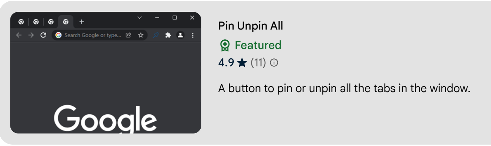

# Pin Unpin All

A Chrome browser extension that adds a button to pin or unpin all the tabs in the window.

------

## Description

Click the button to pin/unpin all tabs in the current window based on the state of the active tab.

For a keyboard shortcut go to: chrome://extensions/shortcuts.

Compatible with dark and light themes.

## Support

View details in the [chrome web store](https://chrome.google.com/webstore/detail/pin-unpin-all/cpncfbofpjgdfpmdacbagkaoglmkhnne).

Get developer support at [ev0lut1on.com](https://ev0lut1on.com/).

